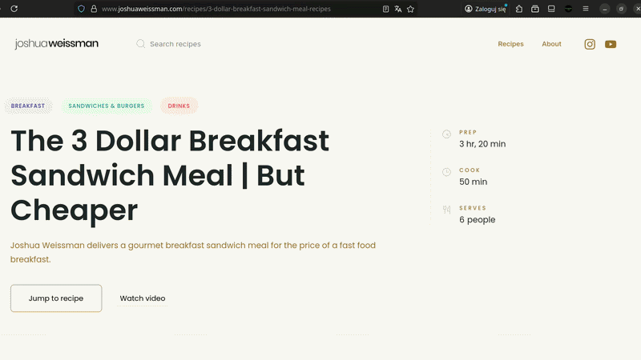
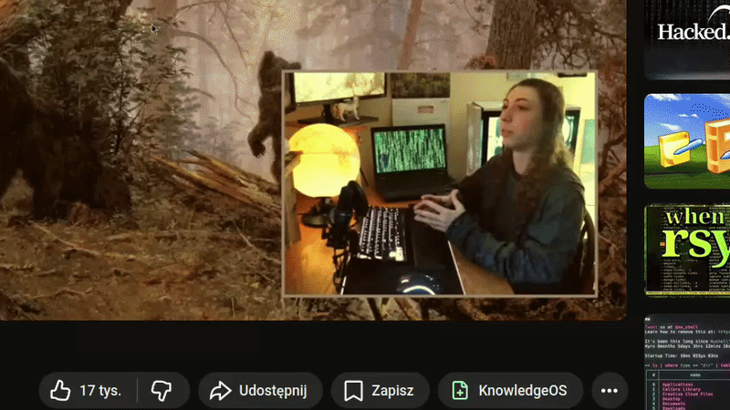

# KnowledgeOS Browser Extension

> A browser extension that lets you save links and YouTube videos to [KnowledgeOS](https://github.com/neliodass/KnowledgeOS) directly from your browser — in a single click.

---

## Preview

**Basic usage — save any webpage**

**YouTube — add a video from the main page (three-dot menu)**

**YouTube — add a video from the watch page**

---

## Features

- **Save any page** — open the popup and send the current tab's URL straight to your KnowledgeOS inbox
- **YouTube integration** — adds a native-looking *"Add to KnowledgeOS"* button to every video's context menu on YouTube
- **Auth & server settings** — configure your self-hosted or cloud KnowledgeOS API URL and log in with your credentials directly from the popup
- **Lightweight** — built with [Plasmo](https://www.plasmo.com/), React 18 and Tailwind CSS; no unnecessary permissions

---

## Download

Pre-built extension packages are available in the [**Releases**](../../releases) section.

| Browser | Build | Notes |
|---------|-------|-------|
| **Mozilla Firefox** | `.xpi` (signed) | Install directly — no extra steps required |
| **Google Chrome** | `.zip` (unsigned) | Must be loaded as an unpacked extension (Developer Mode) |

### Loading the Chrome extension manually

1. Download the latest `chrome-mv3-prod.zip` from [Releases](../../releases) and unzip it
2. Open `chrome://extensions/`
3. Enable **Developer mode** (top-right toggle)
4. Click **Load unpacked** and select the unzipped folder

---

## Requirements

This extension is a companion to the **KnowledgeOS** application.  
You need a running KnowledgeOS instance to use it.

👉 [**KnowledgeOS app**](https://github.com/neliodass/KnowledgeOS)

---

## Tech stack

- [Plasmo](https://www.plasmo.com/) — browser extension framework
- [React 18](https://react.dev/)
- [Tailwind CSS](https://tailwindcss.com/)
- [Lucide React](https://lucide.dev/) — icons
- TypeScript

---

## License

MIT
